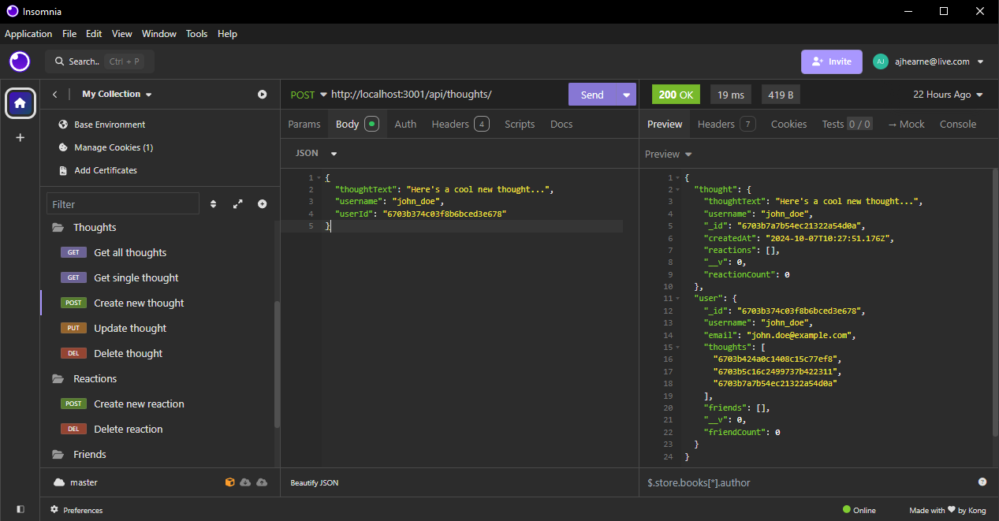

# social-network-api

## Description

18-NoSQL/02-Challenge - Social Network API using MongoDB

This is a RESTful API for a social network web application where users can share their thoughts, react to friends' thoughts, and create a friend list. The application is built using Node.js, Express.js, MongoDB, and Mongoose, providing a scalable and efficient solution for managing user interactions in a social network.

Project executed in accordance with the following challenge requirements:

### User Story

```md
AS A social media startup
I WANT an API for my social network that uses a NoSQL database
SO THAT my website can handle large amounts of unstructured data
```

### Acceptance Criteria

```md
GIVEN a social network API
WHEN I enter the command to invoke the application
THEN my server is started and the Mongoose models are synced to the MongoDB database
WHEN I open API GET routes in Insomnia for users and thoughts
THEN the data for each of these routes is displayed in a formatted JSON
WHEN I test API POST, PUT, and DELETE routes in Insomnia
THEN I am able to successfully create, update, and delete users and thoughts in my database
WHEN I test API POST and DELETE routes in Insomnia
THEN I am able to successfully create and delete reactions to thoughts and add and remove friends to a user’s friend list
```

## Table of Contents

- [Installation](#installation)
- [Usage](#usage)
- [Technologies](#technologies)
- [API Endpoints](#api-endpoints)
- [License](#license)

## Installation

- Install [NodeJS](https://nodejs.org/en) and NPM on your computer to install the required dependencies for this application.
- Install [MongoDB](https://www.mongodb.com/) on your computer to create the database.
- Install [Insomnia](https://insomnia.rest/) on your computer to execute the API requests.

Git and an IDE (VSCode recommended) are required to be installed on your computer to clone and view the code for this web application.

1. Clone the repository:

    ```bash
    ### Clone this repository
    $ git clone https://github.com/ajhearne-mZAOSW/social-network-api.git

    ### Navigate into the repository
    $ cd social-network-api

    ### Open in IDE
    $ code .
    ```

2. Configure your environment variables (e.g., MongoDB connection URI).

3. Install the dependencies:

    ```bash
   npm install
   ```

4. Seed the database:

    ```bash
   npm run seed
   ```

5. Start the server:

    ```bash
   npm start
   ```

The API will be live on http://localhost:3001 by default.

## Usage

The following image shows the application's appearance and functionality:

Finding all users:


Finding all thoughts:


Creating a new user:


Creating a new thought:



A video showing process for using the application can be found [here.](./assets/Hearne_socialNetworksAPI_Demo.webm)

Once the server is running, you can interact with the API using Insomnia. The API provides functionality for:

- Creating and managing users
- Adding, updating, and deleting thoughts
- Adding reactions to thoughts
- Managing user relationships (friend lists)

## Technologies

- **Node.js**: Backend runtime environment
- **Express.js**: Web framework for creating the RESTful API
- **MongoDB**: NoSQL database for storing user data and relationships
- **Mongoose**: ODM (Object Data Modeling) library for MongoDB

## API Endpoints

### Users

- `GET /api/users`: Get all users
- `POST /api/users`: Create a new user
- `GET /api/users/:userId`: Get a user by ID
- `PUT /api/users/:userId`: Update a user by ID
- `DELETE /api/users/:userId`: Delete a user by ID

### Thoughts

- `GET /api/thoughts`: Get all thoughts
- `POST /api/thoughts`: Create a new thought
- `GET /api/thoughts/:thoughtId`: Get a thought by ID
- `PUT /api/thoughts/:thoughtId`: Update a thought by ID
- `DELETE /api/thoughts/:thoughtId`: Delete a thought by ID

### Friends

- `POST /api/users/:userId/friends/:friendId`: Add a friend
- `DELETE /api/users/:userId/friends/:friendId`: Remove a friend

### Reactions

- `POST /api/thoughts/:thoughtId/reactions`: Add a reaction to a thought
- `DELETE /api/thoughts/:thoughtId/reactions/:reactionId`: Remove a reaction from a thought

## License

This project is licensed under the MIT License. See the [LICENSE](./LICENSE) file for details.
